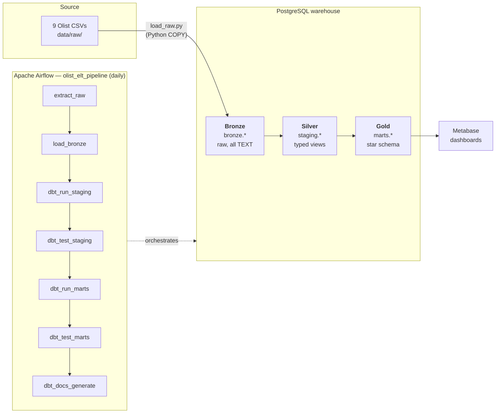
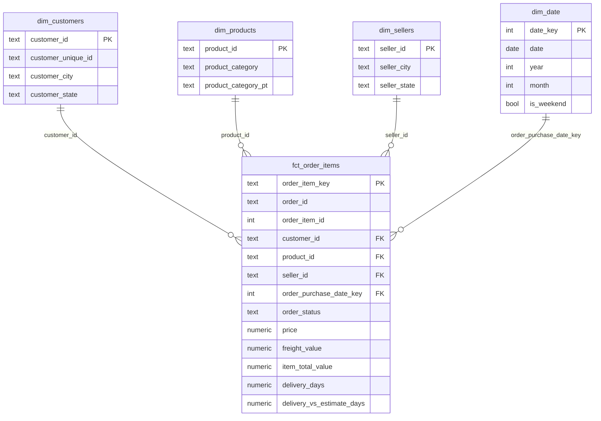
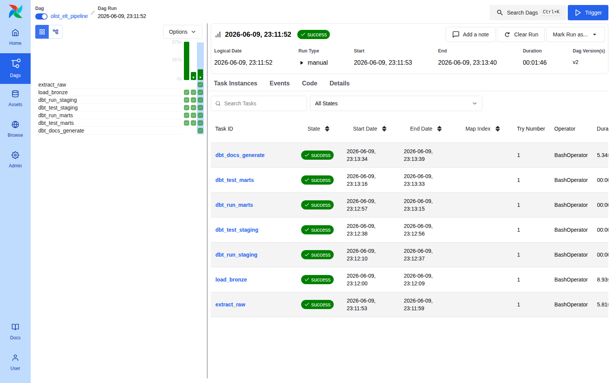
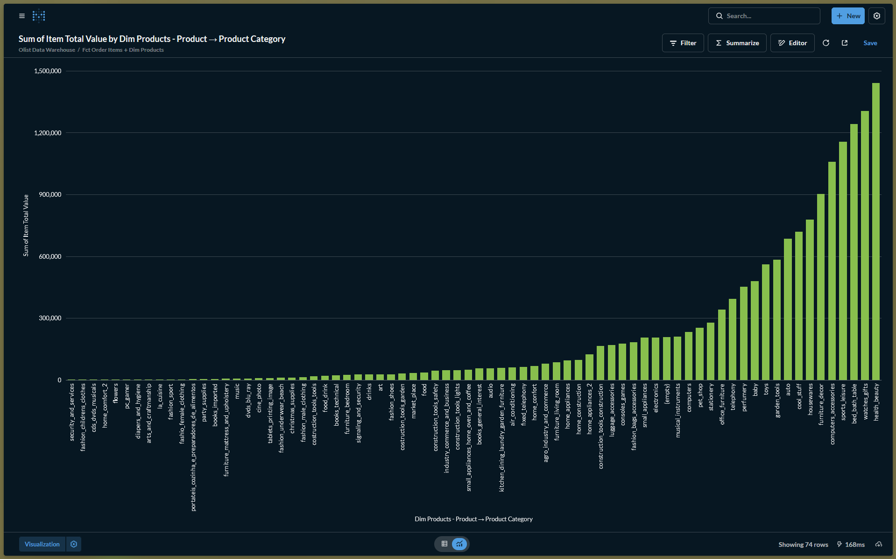
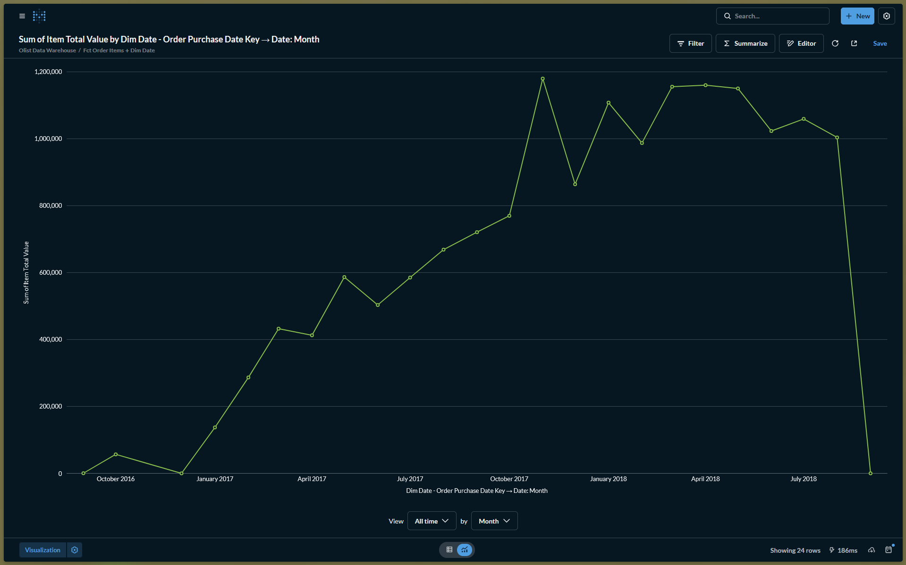
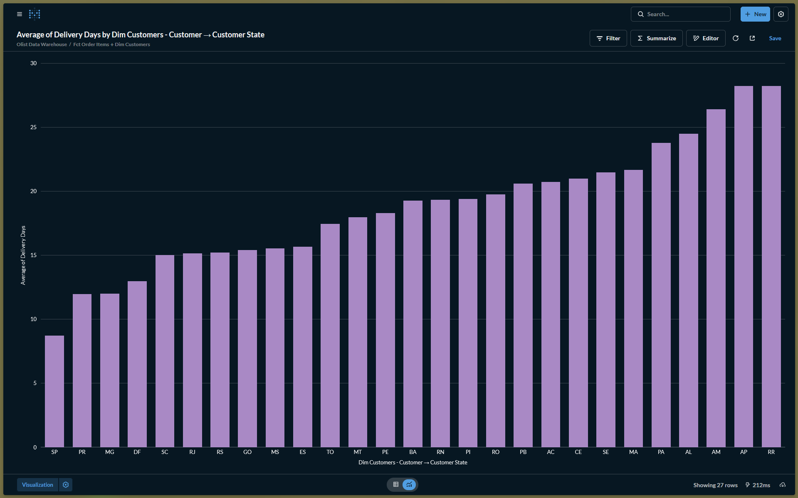

# Olist Medallion ELT Pipeline

An end-to-end, containerized **ELT pipeline** on the Brazilian E-Commerce
(Olist) dataset, built on a three-layer **medallion architecture** and
orchestrated by **Apache Airflow**.

Raw CSVs are loaded into PostgreSQL (Bronze), cleaned and typed with dbt
(Silver), and modeled into a **star schema** (Gold) that powers Metabase
dashboards. The whole flow runs on a schedule, end-to-end, inside Docker.

| | |
|---|---|
| **Warehouse** | PostgreSQL 16 |
| **Transformations** | dbt 1.8 (`dbt-postgres`) |
| **Orchestration** | Apache Airflow 3.0.1 (LocalExecutor) |
| **BI** | Metabase |
| **Packaging** | Docker Compose |

---

## Architecture



This is an ELT pipeline: data lands raw first, then every
transformation happens inside the warehouse with dbt. Each medallion layer
adds another round of cleaning and structure:

| Layer | Schema | What it is | Materialization |
|-------|--------|------------|-----------------|
| **Bronze** | `bronze` | Exact copy of source CSVs, all columns `TEXT`, no logic | tables (full refresh) |
| **Silver** | `staging` | Cleaned, renamed, correctly-typed | views |
| **Gold** | `marts` | Star schema (fact + dimensions) for BI | tables |

---

## Dataset

The **[Brazilian E-Commerce Public Dataset by Olist](https://www.kaggle.com/datasets/olistbr/brazilian-ecommerce)**:
about 100K orders placed between 2016 and 2018 across multiple Brazilian
marketplaces, spread over 9 related CSV files.

> **Data provenance:** the canonical source is Kaggle (link above). For this
> build the files were pulled from a public **Hugging Face mirror**
> (`aviahYadler/Olist_Ecommerce_Dataset`) because the build environment had no
> Kaggle credentials. `download_data.py` verifies every file against both its
> canonical Olist **row count** and a pinned **SHA-256 checksum**, so a
> tampered or swapped mirror is caught before it loads.

| File | Bronze table | Rows |
|------|--------------|------|
| `olist_orders_dataset.csv` | `orders` | 99,441 |
| `olist_customers_dataset.csv` | `customers` | 99,441 |
| `olist_order_items_dataset.csv` | `order_items` | 112,650 |
| `olist_order_payments_dataset.csv` | `order_payments` | 103,886 |
| `olist_order_reviews_dataset.csv` | `order_reviews` | 99,224 |
| `olist_products_dataset.csv` | `products` | 32,951 |
| `olist_sellers_dataset.csv` | `sellers` | 3,095 |
| `olist_geolocation_dataset.csv` | `geolocation` | 1,000,163 |
| `product_category_name_translation.csv` | `product_category_name_translation` | 71 |
| | **Total** | **1,550,922** |

### Data model — star schema

Gold models the order-item fact at the **order-item grain**, surrounded by four
conformed dimensions (a classic star schema). This is the entity-relationship
model that the Metabase dashboards query:



| Table | Grain | Rows |
|-------|-------|------|
| `fct_order_items` | one item line per order | 112,650 |
| `dim_customers` | customer_id (per-order key) | 99,441 |
| `dim_products` | product_id | 32,951 |
| `dim_sellers` | seller_id | 3,095 |
| `dim_date` | one calendar day | 774 |

---

## Project structure

```
DATA_ENG_ALP/
├── docker-compose.yml          # the full stack (warehouse, airflow, metabase)
├── .env.example                # config template (copy to .env)
├── container/
│   ├── airflow.Dockerfile      # Airflow image + isolated dbt venv
│   ├── requirements.txt        # ingestion deps (psycopg2) for Airflow's env
│   ├── dbt-requirements.txt    # fully-pinned dbt lockfile
│   └── dags/
│       └── olist_pipeline.py   # the Airflow DAG
├── ingestion/
│   ├── download_data.py        # Extract: fetch + verify the 9 CSVs (row count + SHA256)
│   └── load_raw.py             # Bronze loader (idempotent COPY)
├── dbt/
│   ├── dbt_project.yml
│   ├── profiles.yml            # connection via env vars
│   ├── macros/
│   │   └── generate_schema_name.sql
│   └── models/
│       ├── staging/            # Silver: 8 stg_*.sql + tests (_staging.yml)
│       └── marts/              # Gold: dim_*/fct_* + tests (_marts.yml)
├── data/raw/                   # the 9 Olist CSVs (gitignored)
└── credentials/
```

---

## Quickstart

**Prerequisites:** Docker + Docker Compose, Python 3 (only for the data-download
helper), and an internet connection on first run.

```bash
# 1. Get the raw data (downloads the 9 Olist CSVs into data/raw/, verifies them)
python ingestion/download_data.py

# 2. Configure  (macOS / Linux)
cp .env.example .env
echo "AIRFLOW_UID=$(id -u)" >> .env     # so bind-mounted logs stay writable

# 3. Launch the whole stack
docker compose up -d

# 4. Open the UIs
#    Airflow   → http://localhost:8000   (admin / admin)
#    Metabase  → http://localhost:3000   (first-run setup wizard)

# 5. Run the pipeline
#    In Airflow: enable the `olist_elt_pipeline` DAG and click ▶ Trigger.
#    All 7 tasks complete end-to-end in ~1–2 minutes.
```

> **Windows (PowerShell):** steps 1, 3, 4 and 5 are identical; only the
> configure step differs (no `cp` / `id -u`):
>
> ```powershell
> # 2. Configure
> Copy-Item .env.example .env
> # AIRFLOW_UID is only needed for Linux bind-mount permissions. On Docker
> # Desktop (Windows/macOS) the default 50000 already works, so leave .env as-is.
> ```

> The data is **not** committed to git (it's large and gitignored), so step 1
> is required on a fresh clone. The download script is idempotent: files
> already present with a matching row count and SHA-256 checksum are skipped.

> **Ports note:** this project intentionally uses non-default host ports
> (warehouse `5442`, Airflow `8000`) to avoid clashing with anything already
> bound to the usual `5432` / `8080`. All values live in `.env`.

---

## Expected Output

After a successful trigger you should see the DAG complete all seven tasks, and
the Metabase dashboards populate from the Gold (`marts`) schema.

### Airflow DAG — graph view (successful run)

All seven tasks run in sequence and finish green
(`extract_raw → load_bronze → dbt_run_staging → dbt_test_staging → dbt_run_marts → dbt_test_marts → dbt_docs_generate`):



### Metabase dashboards

Built on the `marts` (Gold) schema; three charts answer concrete business
questions.

> **Metabase connection note:** Metabase runs *inside* the Docker network, so
> connect it to the warehouse using host **`warehouse`** and port **`5432`**
> (the internal port) — *not* `localhost:5442`.

**1. Revenue by Product Category** — where the money comes from.



**2. Monthly Revenue Trend** — revenue growth across 2016–2018.



**3. Delivery Performance by State** — average delivery days by customer state.



---

## Pipeline walkthrough

### Bronze — `ingestion/load_raw.py`

A pure-Python loader that `COPY`s each CSV into the `bronze` schema with all
columns as `TEXT`, an untransformed copy of the source. It is idempotent:
every run drops and recreates each table, so re-running always yields the same
state (a full refresh). `COPY` is used for speed (the geolocation file alone is
~1M rows).

### Silver — `dbt/models/staging/`

Eight dbt views (no data stored) that sit on top of Bronze. Each one casts
types, renames columns, and joins in trivial lookups (products gets its English
category name here).

```
stg_orders   stg_order_items   stg_customers   stg_sellers
stg_products   stg_order_payments   stg_order_reviews   stg_geolocation
```

### Gold — `dbt/models/marts/`

A star schema materialized as physical tables: one fact at the order-item
grain, surrounded by four conformed dimensions. `fct_order_items` is
materialized `incremental` (on `order_purchase_timestamp`, keyed by
`order_item_key`). A `--full-refresh` builds every row, while a normal daily run
only (re)loads orders at or after the high-water mark and `delete+insert`s them,
so re-running the same day is idempotent and cheap.

> The entity-relationship diagram and per-table row counts for this star schema
> are shown above under [**Dataset → Data model**](#data-model--star-schema).

---

## Orchestration

The Airflow DAG **`olist_elt_pipeline`** runs the whole flow on a `@daily`
schedule, one task after another. Extract and load are included, so the entire
ingestion-to-docs path is orchestrated, not just the transforms. If any
data-quality test fails the run stops before anything reaches Gold.

```
extract_raw → load_bronze → dbt_run_staging → dbt_test_staging
            → dbt_run_marts → dbt_test_marts → dbt_docs_generate
```

- **`extract_raw`**: runs `download_data.py` (idempotent: skips files already
  present with the right row count + checksum). Needs outbound internet only on
  the first run.
- **`load_bronze`**: full-refresh COPY into `bronze`.
- **`dbt_run/test_*`**: build + test Silver, then Gold.
- **`dbt_docs_generate`**: builds the dbt docs site (`manifest.json` + `catalog.json`).

The graph-view screenshot of a successful run is shown under
[**Expected Output**](#airflow-dag--graph-view-successful-run).

---

## Data quality

Tests are defined in dbt (`_staging.yml`, `_marts.yml`) and run as dedicated
DAG tasks. **49 data tests** across the Silver and Gold layers, all passing:

- **Primary keys:** `unique` + `not_null` on every dimension PK and the fact's surrogate key.
- **Referential integrity:** `relationships` tests on all four foreign keys from `fct_order_items` to its dimensions.
- **Domain checks:** `accepted_values` on `order_status` (8 valid states), `payment_type`, and `review_score` (1–5).
- **Documented quirks:** `review_id` is intentionally *not* tested for uniqueness (the Olist source legitimately repeats it across orders).

```bash
# run all transformations + tests manually (outside Airflow)
docker compose exec airflow-scheduler /opt/dbt-venv/bin/dbt build \
  --project-dir /opt/airflow/dbt --profiles-dir /opt/airflow/dbt
```

---

## dbt documentation

The DAG's final task (`dbt_docs_generate`) builds the dbt docs site
(`target/manifest.json` + `catalog.json`) on every run. To browse the
auto-generated model/column lineage and descriptions locally:

```bash
docker compose exec airflow-scheduler /opt/dbt-venv/bin/dbt docs generate \
  --project-dir /opt/airflow/dbt --profiles-dir /opt/airflow/dbt
docker compose exec airflow-scheduler /opt/dbt-venv/bin/dbt docs serve \
  --project-dir /opt/airflow/dbt --profiles-dir /opt/airflow/dbt --port 8080
```

---

## Findings & Conclusion

Reading the three Gold-backed dashboards together:

- **Revenue is concentrated in a handful of categories.** A small set of product
  categories (health & beauty, watches & gifts, bed/bath/table, sports & leisure)
  drives a disproportionate share of total revenue — a classic long-tail
  distribution where the top ~10 categories dominate and the remaining dozens
  contribute marginally.
- **The business grew strongly across 2016–2018.** The monthly revenue trend
  climbs steeply through 2017 and into 2018 from a near-zero 2016 base, with the
  tail months thinning out as the dataset's coverage ends — consistent with
  Olist's real growth over the period.
- **Delivery performance varies widely by state.** Average delivery time is
  fastest in the southeastern states near the sellers (e.g. São Paulo) and
  markedly slower for remote northern/north-eastern states, where orders travel
  much farther — a clear logistics signal for where to add fulfilment capacity.

**Conclusion.** The pipeline successfully turns nine raw, untyped CSVs into a
trustworthy, queryable star schema: the medallion layers separate raw landing
from cleaning from business modeling, dbt tests gate every layer so bad data
never reaches Gold, and Airflow orchestrates the entire extract-to-docs path on a
schedule. The resulting Gold tables answer real commercial questions
(what sells, how revenue trends, where delivery lags) directly in Metabase
without any further hand-wrangling.

---

## Known Limitations

- **Static, historical dataset.** Olist is a fixed 2016–2018 dump, so the
  `@daily` schedule has no genuinely new data to ingest. The schedule
  demonstrates **idempotent** re-runs (Bronze full-refresh, incremental fact)
  rather than true incremental capture; on a live feed the incremental fact
  would pick up only the new slice, but here it is a no-op after the first load.
- **Geolocation & reviews are excluded from Gold.** Both exist in Bronze/Silver
  but don't fit the order-item grain cleanly (geolocation has ~1M rows with no
  clean FK; `review_id` legitimately repeats across orders), so they're kept out
  of the star schema.
- **`dim_customers` is keyed at the per-order grain.** Olist generates a fresh
  `customer_id` per order, so the dimension matches the fact's grain rather than
  the real person. The true-person key (`customer_unique_id`) is carried as an
  attribute, so unique-buyer counts require a `count(distinct …)`.
- **No production hardening.** As a course project, tasks use `retries: 1` with
  no alerting, no DAG SLAs, and no `dbt source freshness` checks. Production
  would add `on_failure_callback` (Slack/email), backoff retries, and freshness
  monitoring.
- **Single-node, local-only.** The stack runs on Airflow's `LocalExecutor` in
  Docker Compose on one machine — fine for this dataset, but not horizontally
  scalable and not a deployment topology.

---

## Design decisions & notes

- **"Daily" on a static dataset.** The Olist source is a fixed 2016–2018
  historical dump, so there is no genuinely "new" data each day. The pipeline
  is honest about this: Bronze is a daily **full refresh** (drop + reload), and
  `fct_order_items` loads **incrementally** on `order_purchase_timestamp`. Both
  make re-running a given day idempotent (the same input always yields the
  same warehouse state), which is the property the daily schedule is meant to
  demonstrate. On a live feed the incremental fact would pick up only the new
  slice; here it's a no-op after the first load.
- **dbt in an isolated venv.** dbt is installed into its own
  `/opt/dbt-venv` inside the Airflow image (from a fully-pinned
  `dbt-requirements.txt` lockfile) so its dependencies never collide with
  Airflow's pinned constraint set. The DAG calls it by absolute path.
- **`dim_customers` grain.** It's keyed on `customer_id`, which in Olist is
  generated **per order** (one row per order, 99,441 total), not on the real
  person. That's deliberate: the fact only carries the order-scoped
  `customer_id`, so the dimension must match that grain to join. The true-person
  key, `customer_unique_id`, is carried through as an attribute, so unique-buyer
  counts are still one `count(distinct …)` away.
- **Geolocation & reviews excluded from Gold.** Both are available in
  Bronze/Silver but don't fit the order-item grain cleanly (geolocation has
  ~1M rows with no clean FK; reviews repeat `review_id`), so they're kept out
  of the star schema.
- **Airflow 3 specifics.** v3 splits the API server, scheduler, and
  dag-processor into separate services and requires
  `AIRFLOW__CORE__EXECUTION_API_SERVER_URL` and a shared
  `AIRFLOW__API_AUTH__JWT_SECRET` across containers for task execution to work.
- **Production hardening (not built).** This is a course project: tasks use
  `retries: 1` and there's no alerting. For production I'd add an
  `on_failure_callback` (Slack/email), more aggressive retries with backoff,
  SLAs on the DAG, and source-freshness checks via `dbt source freshness`.

---

## Reference

### Services & ports

| Service | Container | Host URL / port | Credentials |
|---------|-----------|-----------------|-------------|
| Airflow UI | `olist_airflow_apiserver` | http://localhost:8000 | `admin` / `admin` |
| Metabase | `olist_metabase` | http://localhost:3000 | set on first visit |
| Warehouse (Postgres) | `olist_warehouse` | `localhost:5442` | `olist` / `olist` (db `olist`) |
| Airflow metadata DB | `olist_airflow_db` | internal | `airflow` / `airflow` |

### Common commands

```bash
docker compose ps                 # service status
docker compose logs -f <service>  # tail a service
docker compose down               # stop (keep data)
docker compose down -v            # stop + wipe all data volumes
```

### Connect to the warehouse directly

```bash
docker exec -it -e PGPASSWORD=olist olist_warehouse psql -U olist -d olist
# then: \dn (schemas)  \dt marts.* (gold tables)
```
