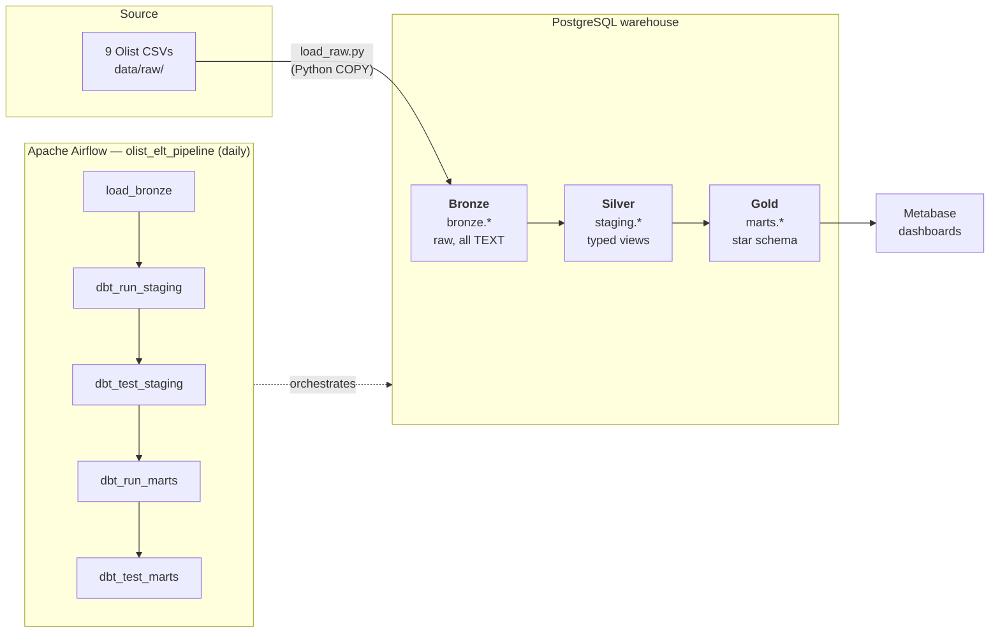
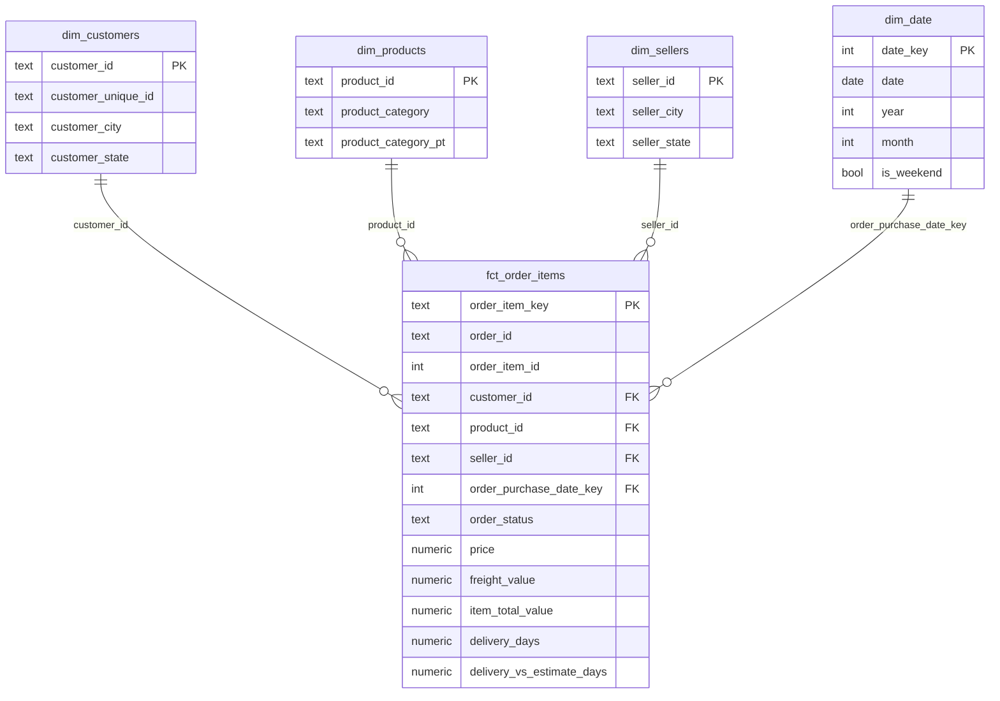

# Olist Medallion ELT Pipeline

An end-to-end, containerized **ELT pipeline** on the Brazilian E-Commerce
(Olist) dataset, built on a three-layer **medallion architecture** and
orchestrated by **Apache Airflow**.

Raw CSVs are loaded into PostgreSQL (Bronze), cleaned and typed with dbt
(Silver), and modeled into a **star schema** (Gold) that powers Metabase
dashboards — the whole flow runs on a schedule, end-to-end, inside Docker.

| | |
|---|---|
| **Warehouse** | PostgreSQL 16 |
| **Transformations** | dbt 1.8 (`dbt-postgres`) |
| **Orchestration** | Apache Airflow 3.0.1 (LocalExecutor) |
| **BI** | Metabase |
| **Packaging** | Docker Compose |

---

## Architecture



The pipeline is **ELT, not ETL**: data lands raw first, then every
transformation happens *inside* the warehouse with dbt. Each medallion layer
adds trust:

| Layer | Schema | What it is | Materialization |
|-------|--------|------------|-----------------|
| 🥉 **Bronze** | `bronze` | Exact copy of source CSVs, all columns `TEXT`, no logic | tables (full refresh) |
| 🥈 **Silver** | `staging` | Cleaned, renamed, correctly-typed | views |
| 🥇 **Gold** | `marts` | Star schema (fact + dimensions) for BI | tables |

---

## Dataset

The **[Brazilian E-Commerce Public Dataset by Olist](https://www.kaggle.com/datasets/olistbr/brazilian-ecommerce)**
— ~100K orders placed between 2016–2018 across multiple Brazilian
marketplaces, spread over 9 related CSV files.

> **Data provenance:** the canonical source is Kaggle (link above). For this
> build the files were pulled from a public **Hugging Face mirror**
> (`aviahYadler/Olist_Ecommerce_Dataset`) because the build environment had no
> Kaggle credentials. All nine files were verified row-for-row against the
> canonical Olist counts before use.

| File | Bronze table | Rows |
|------|--------------|------|
| `olist_orders_dataset.csv` | `orders` | 99,441 |
| `olist_customers_dataset.csv` | `customers` | 99,441 |
| `olist_order_items_dataset.csv` | `order_items` | 112,650 |
| `olist_order_payments_dataset.csv` | `order_payments` | 103,886 |
| `olist_order_reviews_dataset.csv` | `order_reviews` | 99,224 |
| `olist_products_dataset.csv` | `products` | 32,951 |
| `olist_sellers_dataset.csv` | `sellers` | 3,095 |
| `olist_geolocation_dataset.csv` | `geolocation` | 1,000,163 |
| `product_category_name_translation.csv` | `product_category_name_translation` | 71 |
| | **Total** | **1,550,922** |

---

## Project structure

```
DATA_ENG_ALP/
├── docker-compose.yml          # the full stack (warehouse, airflow, metabase)
├── .env.example                # config template (copy to .env)
├── container/
│   ├── airflow.Dockerfile      # Airflow image + isolated dbt venv
│   ├── requirements.txt        # ingestion deps (psycopg2) for Airflow's env
│   ├── dbt-requirements.txt    # fully-pinned dbt lockfile
│   └── dags/
│       └── olist_pipeline.py   # the Airflow DAG
├── ingestion/
│   └── load_raw.py             # Bronze loader (idempotent COPY)
├── dbt/
│   ├── dbt_project.yml
│   ├── profiles.yml            # connection via env vars
│   ├── macros/
│   │   └── generate_schema_name.sql
│   └── models/
│       ├── staging/            # Silver: 8 stg_*.sql + tests (_staging.yml)
│       └── marts/              # Gold: dim_*/fct_* + tests (_marts.yml)
├── data/raw/                   # the 9 Olist CSVs (gitignored)
└── credentials/
```

---

## Quickstart

**Prerequisites:** Docker + Docker Compose, and the 9 Olist CSVs in `data/raw/`.

```bash
# 1. Configure
cp .env.example .env
echo "AIRFLOW_UID=$(id -u)" >> .env     # so bind-mounted logs stay writable

# 2. Launch the whole stack
docker compose up -d

# 3. Open the UIs
#    Airflow   → http://localhost:8000   (admin / admin)
#    Metabase  → http://localhost:3000   (first-run setup wizard)

# 4. Run the pipeline
#    In Airflow: enable the `olist_elt_pipeline` DAG and click ▶ Trigger.
#    It completes end-to-end in ~35 seconds.
```

> **Ports note:** this project intentionally uses non-default host ports
> (warehouse `5442`, Airflow `8000`) to avoid clashing with anything already
> bound to the usual `5432` / `8080`. All values live in `.env`.

---

## Pipeline walkthrough

### 🥉 Bronze — `ingestion/load_raw.py`

A pure-Python loader that `COPY`s each CSV into the `bronze` schema with **all
columns as `TEXT`** — a faithful, untransformed copy of the source. It is
**idempotent**: every run drops and recreates each table, so re-running always
yields the same state (a full refresh). `COPY` is used for speed (the
geolocation file alone is ~1M rows).

### 🥈 Silver — `dbt/models/staging/`

Eight dbt **views** (no data stored) that sit on top of Bronze and do three
things: **cast types**, **rename** columns, and **join** trivial lookups
(products gets its English category name here).

```
stg_orders   stg_order_items   stg_customers   stg_sellers
stg_products   stg_order_payments   stg_order_reviews   stg_geolocation
```

### 🥇 Gold — `dbt/models/marts/`

A classic **star schema** materialized as physical tables — one fact at the
order-item grain, surrounded by four conformed dimensions.



| Table | Grain | Rows |
|-------|-------|------|
| `fct_order_items` | one item line per order | 112,650 |
| `dim_customers` | customer_id (per-order key) | 99,441 |
| `dim_products` | product_id | 32,951 |
| `dim_sellers` | seller_id | 3,095 |
| `dim_date` | one calendar day | 774 |

---

## Orchestration

The Airflow DAG **`olist_elt_pipeline`** runs the whole flow on a `@daily`
schedule, one task after another. If any data-quality test fails, the run
stops — bad data never reaches Gold.

```
load_bronze → dbt_run_staging → dbt_test_staging → dbt_run_marts → dbt_test_marts
```

<!-- SCREENSHOT: Airflow DAG graph view showing all 5 tasks green (success) -->
> 📸 _Airflow DAG graph screenshot — to be added._

---

## Data quality

Tests are defined in dbt (`_staging.yml`, `_marts.yml`) and run as dedicated
DAG tasks. **62 tests** total, all passing:

- **Primary keys** — `unique` + `not_null` on every dimension PK and the fact's surrogate key.
- **Referential integrity** — `relationships` tests on all four foreign keys from `fct_order_items` to its dimensions.
- **Domain checks** — `accepted_values` on `order_status` (8 valid states), `payment_type`, and `review_score` (1–5).
- **Documented quirks** — `review_id` is intentionally *not* tested for uniqueness (the Olist source legitimately repeats it across orders).

```bash
# run all transformations + tests manually (outside Airflow)
docker compose exec airflow-scheduler /opt/dbt-venv/bin/dbt build \
  --project-dir /opt/airflow/dbt --profiles-dir /opt/airflow/dbt
```

---

## Dashboards (Metabase)

Built on the `marts` (Gold) schema. Three charts answer concrete business
questions.

> **Metabase connection note:** Metabase runs *inside* the Docker network, so
> connect it to the warehouse using host **`warehouse`** and port **`5432`**
> (the internal port) — *not* `localhost:5442`.

<!-- ============================================================ -->
<!-- TODO (teammate): Metabase dashboards + screenshots           -->
<!-- ============================================================ -->

### 1. Revenue by product category
> 🚧 _In progress — chart + screenshot to be added._

### 2. Monthly revenue trend
> 🚧 _In progress — chart + screenshot to be added._

### 3. Delivery performance by state
> 🚧 _In progress — chart + screenshot to be added._

---

## Design decisions & notes

- **dbt in an isolated venv.** dbt is installed into its own
  `/opt/dbt-venv` inside the Airflow image (from a fully-pinned
  `dbt-requirements.txt` lockfile) so its dependencies never collide with
  Airflow's pinned constraint set. The DAG calls it by absolute path.
- **`customer_id` vs `customer_unique_id`.** In Olist, `customer_id` is
  generated per *order*; `customer_unique_id` identifies the real person. The
  fact joins on `customer_id`; use `customer_unique_id` to count unique buyers.
- **Geolocation & reviews excluded from Gold.** Both are available in
  Bronze/Silver but don't fit the order-item grain cleanly (geolocation has
  ~1M rows with no clean FK; reviews repeat `review_id`), so they're kept out
  of the star schema.
- **Airflow 3 specifics.** v3 splits the API server, scheduler, and
  dag-processor into separate services and requires
  `AIRFLOW__CORE__EXECUTION_API_SERVER_URL` and a shared
  `AIRFLOW__API_AUTH__JWT_SECRET` across containers for task execution to work.

---

## Reference

### Services & ports

| Service | Container | Host URL / port | Credentials |
|---------|-----------|-----------------|-------------|
| Airflow UI | `olist_airflow_apiserver` | http://localhost:8000 | `admin` / `admin` |
| Metabase | `olist_metabase` | http://localhost:3000 | set on first visit |
| Warehouse (Postgres) | `olist_warehouse` | `localhost:5442` | `olist` / `olist` (db `olist`) |
| Airflow metadata DB | `olist_airflow_db` | internal | `airflow` / `airflow` |

### Common commands

```bash
docker compose ps                 # service status
docker compose logs -f <service>  # tail a service
docker compose down               # stop (keep data)
docker compose down -v            # stop + wipe all data volumes
```

### Connect to the warehouse directly

```bash
docker exec -it -e PGPASSWORD=olist olist_warehouse psql -U olist -d olist
# then: \dn (schemas)  \dt marts.* (gold tables)
```
